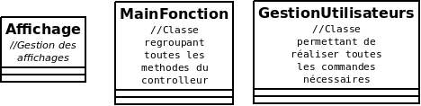

## Description

Dans le cadre d’un projet DevOps de 1ere année de bts SIO j’ai décidé de créer un logiciel permettant d’installer automatiquement pure-ftpd, pouvoir créer des utilisateurs et gérer leurs droit sur le serveur ftp

## Installation

Lors du lancement du programme si pure-ftpd n'est pas encore installé sur votre machine le logiciel vous proposera de l'installer et de le configurer automatiquement

## A propos du projet

Structure du programme:

Ce programme est réalisé en dart avec la méthode POO  

  
Les méthodes des classes sont commentées je vous invite à aller voir le code pour plus de détails sur les méthodes
  
## Fonctionnalités

Ce logiciel permet de :  
  Installer et configurer pure-ftpd si ce n’est pas fait sur la machine  
  afficher les utilisateurs virtuels  
  créer des utilisateurs virtuels  
  gérer les utilisateurs virtuels :  
  -Limiter la bande passante de téléchargement  
  -Limiter la bande passante de l’envoi  
  -Quota en nombre de fichier max  
  -Quota en taille maximale utilisable  
  -Autoriser une ip depuis laquelle l’utilisateur peut se connecter  
  -Interdire une ip depuis laquelle l’utilisateur peut se connecter  
  -Limitation horaire   
  -Limitation du nombre de session simultanée autorisée  
  -Supprimer un utilisateur  
  

## Tests
